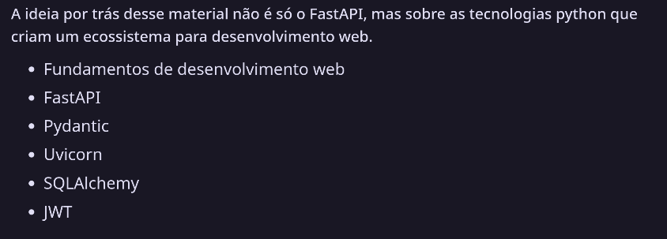
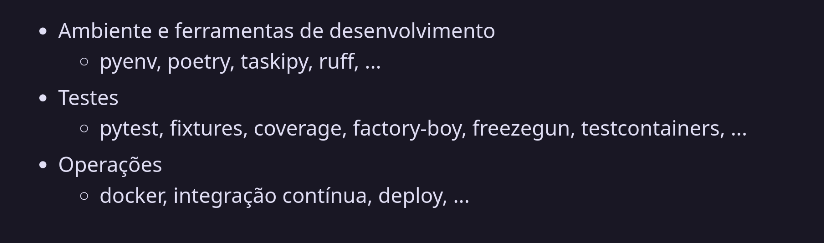
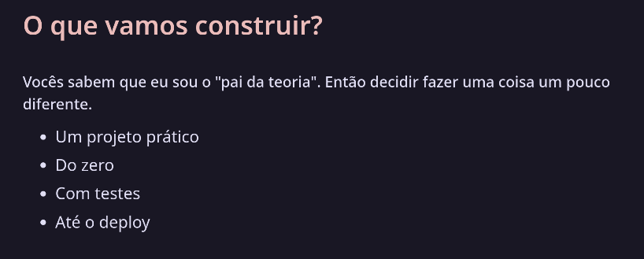
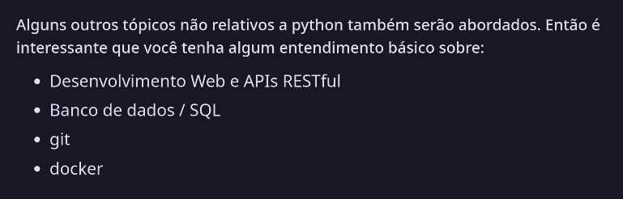

# 02/01/25 - FASTAPI - O QUE VAMOS APRENDER - DAY 1 - (curso FastAPI: Eduardo Mendes - http://www.youtube.com/@Dunossauro)

**O que é FastAPI?**
- FastAPI é um framework Python moderno, projetado para simplicidade, velocidade e eficiência. A combinação de diversas funcionalidades modernas do Python como anotações de tipo e suporte a concorrência, facilitando o desenvolvimento de APIs.

### Pré requisitos para ter melhor aproveitamento do curso:

- https://www.youtube.com/live/0yXPQZvlgrk?si=3BmrFybzEyCzjeMT (Funções)
- O funcionamento das estruturas de dados: como listas, dicionários e etc;
- https://www.youtube.com/live/BALM_oJcJL4?si=5XNWzIu3FHGgpDcF (POO)
- https://www.youtube.com/live/NtZY3AmsBSk?si=QD1Nt2YwLNDkL1CO (Classes)
- Desenvolvimento Web e APIs RESTful: não essencial, pois iremos abordar, mas o quanto mais você souber melhor para acompanhar;
- Banco de dados / SQL: Um conhecimento básico sobre criação e busca de dados usando SQL já o suficiente, embora esse tópico também seja como o anterior, quanto mais você souber melhor;
- git: não nos aprofundaremos nesse tópico durante o curso, mas usaremos operações básicas de git (como commit e push);
- docker: também não nos aprofundaremos nesse tópico e ele só será abordado nas aulas finais. Mas, também, só usaremos comandos básicos de docker e docker-compose.

