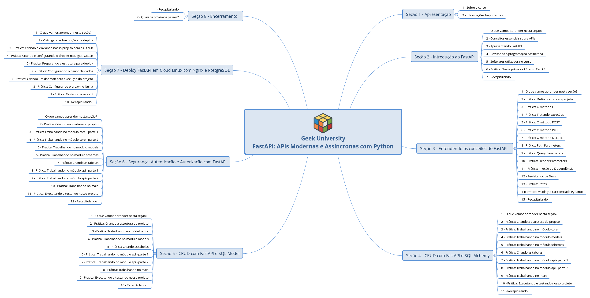
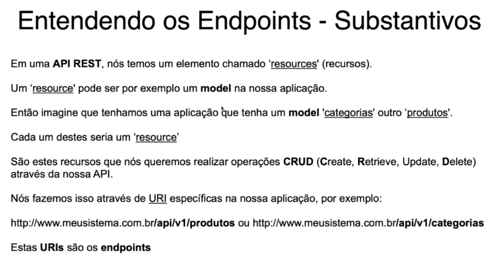
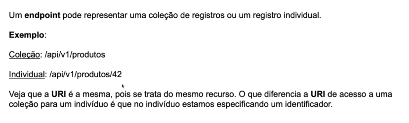
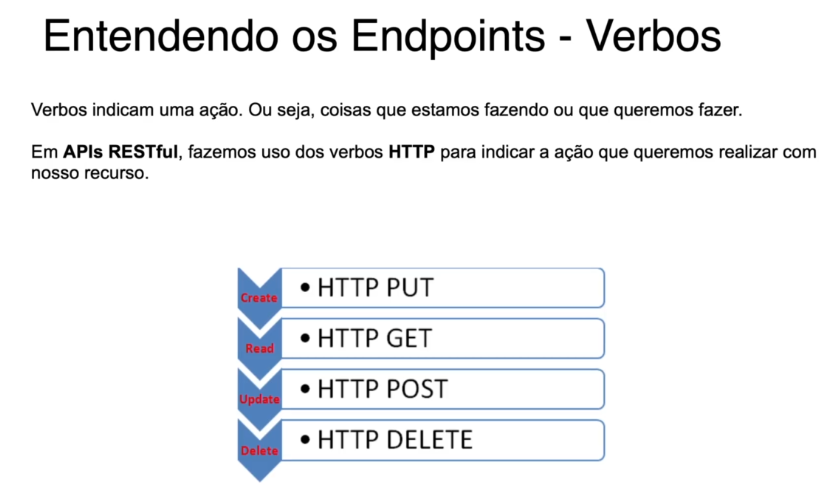
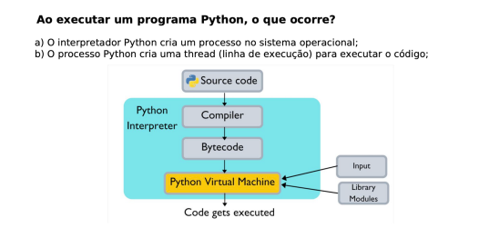
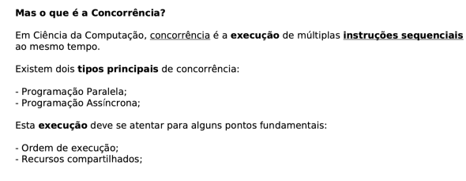
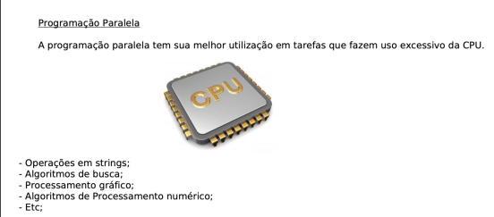
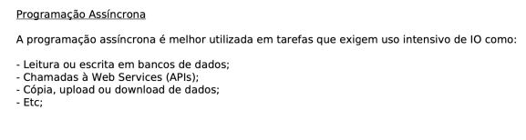
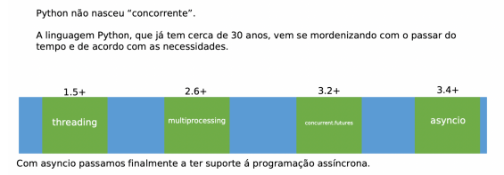

# 03/12/2024 - FASTAPI UDEMY - O QUE VAMOS APRENDER - DAY 1

## SEÇÃO 1: Apresentação

### 1. Sobre  o curso

### 2. Informações importantes

- Recomendo que faça anotações em cada uma das aulas, revise suas revisões de tempos em tempos para que seu cérebro entenda que esta informação que você está estudando é importante e merece ser armazenada.

## SEÇÃO 2: Introdução ao FastAPI

### 3. O que vamos aprender nesta seção?

### 4. Conceitos essenciais sobre APIs. 

**O que é uma API?**
API (Application Programming Interface) é um conjunto de definições e protocolos que permite a comunicação entre diferentes sistemas de software. As APIs permitem que diferentes aplicações se conectem, troquem dados e realizem operações de maneira padronizada, sem que o desenvolvedor precise entender a implementação interna dos sistemas que interagem.

**O que é REST?**
REST (Representational State Transfer) é um estilo arquitetural usado para criar APIs, baseado no uso de padrões HTTP. Ele define um conjunto de restrições para a interação entre cliente e servidor. As principais características de REST incluem:

1. **Cliente-servidor**: A arquitetura é dividida em clientes e servidores, cada um com suas responsabilidades. O cliente solicita recursos, e o servidor os fornece.
2. **Sem estado (Stateless)**: Cada requisição do cliente ao servidor deve conter todas as informações necessárias para ser processada, sem depender de contexto de requisições anteriores.
3. **Cacheável**: Respostas do servidor podem ser armazenadas em cache pelos clientes, aumentando a eficiência.
4. **Interface uniforme**: Usa uma interface padronizada para comunicação, geralmente baseada nos métodos HTTP: 
   - `GET`: Recuperar dados
   - `POST`: Criar novos dados
   - `PUT`: Atualizar dados
   - `DELETE`: Deletar dados
5. **Camadas (Layered System)**: A arquitetura pode ser composta por camadas, onde o cliente interage com uma camada intermediária sem saber da sua existência.

**O que é RESTful?**
Uma API é chamada de **RESTful** quando segue os princípios e restrições do estilo REST. Isso significa que a API está alinhada com as boas práticas de REST, como a utilização adequada dos métodos HTTP, a estruturação de URLs, e o tratamento correto dos recursos. Uma API RESTful organiza seus recursos em URLs, utiliza métodos HTTP de forma consistente e entrega respostas em formatos padrão, como JSON ou XML.

# 04/12/2024 - FASTAPI UDEMY - O QUE VAMOS APRENDER - DAY 2

### 5. Apresentando FastAPI

- FastAPI é um moderno framework de alta-performance para criação de APIs (e websites) com Python.
- Foi criado e publicado em 2018 pelo programador Sebastián Ramírez que estava infeliz com os principais frameworks existentes até o momento, no caso Flask e DRF (Django Rest Framework).
Ramírez então fez uso massivo do typing hints do Python juntamente com as bibliotecas Pydantic e Starlette e fazendo uso nativo de async.

**Principais recursos:**
- Alta Performance: FastAPI oferece performance comparáveis á aplicações NodeJS e Go;
- Rápido para Codificar: Graças ao suporte de auto-complete das IDEs e documentação;
- Ajuda a reduzir o número de bugs: Graças ao uso massivo de typing hints e validações do Pydantic:
- Intuitivo: Segue os padrões web;
- Baseado em padrões de documentação para APIs: OpenAPI e JSON Schema.

### 6. Revisando a Programação Assíncrona

### 7. Softwares utilizados no curso

#### [01] - Python 3.10
Site oficial: [https://www.python.org](https://www.python.org)

- **virtualenv**: Ferramenta para criar ambientes virtuais.
- **virtualenvwrapper**: Conjunto de extensões para trabalhar com múltiplos ambientes virtuais.
- **WORKON_HOME**: Variável de ambiente configurada para definir o diretório dos ambientes virtuais.
---

#### [02] - Visual Studio Code
Site oficial: [https://code.visualstudio.com/](https://code.visualstudio.com/)

### Extensões instaladas:
- **Thunder Client**: Cliente HTTP para testar APIs REST.
- **Material Icon Theme**: Temas de ícones para o VS Code.
- **Python**: Suporte para desenvolvimento em Python no VS Code.
---

#### [03] - PostgreSQL
Site oficial: [https://www.postgresql.org/](https://www.postgresql.org/)

> **Nota**: É possível utilizar o **SQLite**, que já vem integrado ao Python 3.
---

#### [04] - pgAdmin 4 Desktop
Site oficial: [https://www.pgadmin.org/download/pgadmin-4-apt/](https://www.pgadmin.org/download/pgadmin-4-apt/)

- Necessário apenas se optar pelo uso do **Postgres** ao invés do SQLite.
- Alternativamente, pode-se usar outro cliente PostgreSQL.
- Se optar pelo SQLite, será necessário um cliente SQLite, como o **SQLite Browser**.
---